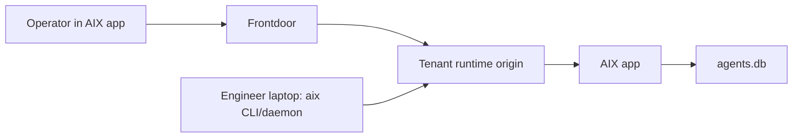

# AIX App

**Status:** CANONICAL
**Last Updated:** 2026-03-11

---

## Purpose

This document defines the target-state architecture for AIX as a standalone Nex
app that collects, receives, stores, and reviews imported AI session history
from many engineer devices.

AIX is the ingestion product.

Spike may consume the resulting session corpus later, but Spike does not own the
AIX ingest lifecycle in this design.

Related active docs:

- [AIX App API And CLI](/Users/tyler/nexus/home/projects/nexus/apps/aix/docs/specs/AIX_APP_API_AND_CLI.md)
- [AIX Hosted Product Workplan](/Users/tyler/nexus/home/projects/nexus/apps/aix/docs/workplans/AIX_HOSTED_PRODUCT_WORKPLAN_2026-03-11.md)
- [AIX Validation Ladder](/Users/tyler/nexus/home/projects/nexus/apps/aix/docs/validation/AIX_APP_VALIDATION_LADDER.md)
- [App Manifest and Package Model](/Users/tyler/nexus/home/projects/nexus/nex/docs/specs/apps/app-manifest-and-package-model.md)
- [Platform Runtime Access and Routing](/Users/tyler/nexus/home/projects/nexus/nex/docs/specs/platform/runtime-access-and-routing.md)
- [Platform Packages and Control Planes](/Users/tyler/nexus/home/projects/nexus/nex/docs/specs/platform/packages-and-control-planes.md)

---

## Customer Experience

The intended AIX experience is:

1. a customer installs the `AIX` app on a Nex server
2. `AIX` appears as its own visible tenant app in the app nav
3. an operator opens `AIX`, picks an engineer entity, and issues an AIX client token
4. AIX returns a copyable setup bundle with:
   - the tenant runtime public base URL
   - the AIX client token
   - the exact CLI commands
   - a full prompt the operator can hand to an engineer or their agent
5. the engineer installs `aix` locally and runs `aix connect`
6. on first connect, the local AIX install self-registers under the authenticated engineer entity
7. the engineer runs one-time backfill, scheduled sync, or live sync
8. recurring sync uses a managed per-user scheduler
   - LaunchAgent on macOS
   - user systemd on Linux
9. the customer watches source health, recent runs, and imported sessions inside the AIX app
10. imported sessions land in one shared `AIX Archive` workspace for that app install and remain queryable by entity, source, provider, and time

Offboarding is one workflow in this system.

It is not the architecture.

---

## Design Rules

1. AIX is a standalone Nex app, not a Spike feature.
2. The AIX app uses one execution model: inline app handler mode.
3. Canonical ownership is entity-centric.
4. One entity may own many AIX sources across many devices over time.
5. Devices are operational metadata, not the canonical owner key.
6. `agents.db` remains the canonical imported session corpus.
7. AIX app state lives in AIX app storage, not in `agents.db`.
8. Hosted human control goes through frontdoor.
9. Hosted machine upload goes directly to the tenant runtime origin.
10. The AIX client token is an explicit machine-auth contract for AIX.
11. Frontdoor `/runtime/*` browser proxying is not the canonical AIX machine upload path.
12. Backward compatibility with the old `sessions.import*` customer flow is out of scope.
13. The packaged AIX app must stay package-safe: no direct imports of Nex monorepo runtime or ledger internals at load time.
14. Inline AIX app handlers interact with `agents.db` and `workspaces` only through runtime-owned operations.

---

## System Topology

Responsibilities:

- Frontdoor
  - authenticates humans
  - routes customers to the correct server
  - installs apps on servers
  - exposes server metadata including `runtime_public_base_url`
  - fulfills `aix.hostedContext.get` for installed AIX apps through the private
    product control plane gateway
- Tenant runtime
  - authenticates and authorizes AIX client tokens
  - hosts the AIX app
  - executes AIX app operations
- AIX app
  - issues and revokes AIX client tokens
  - exposes operator-safe entity selection for token issuance
  - registers sources
  - tracks runs and uploads
  - finalizes imports into `agents.db` through `agents.sessions.import`
  - reads imported-session provenance through `agents.sessions.imports.list`
  - provides the customer-facing AIX UI
- AIX CLI/daemon
  - syncs local AI session sources into local `aix.db`
  - registers with the AIX app
  - uploads changed sessions
  - runs scheduled or live sync locally
  - requires source-scoped recurring sync configuration
  - supports managed recurring incremental sync on:
    - `five_minutes`
    - `ten_minutes`
    - `daily`

---

## Hosted Routing And Auth

### Human control path

Hosted human control uses the normal frontdoor path:

1. the operator authenticates to frontdoor
2. frontdoor launches the installed AIX app on the selected server
3. the operator issues tokens and monitors sources and runs from the AIX app
4. the browser UI calls AIX app operations on `POST /runtime/operations/<method>`
   using the authenticated frontdoor shell/runtime session

When the operator issues or rotates an AIX client token in hosted mode, the
AIX app resolves hosted machine-upload context from frontdoor through:

- `productControlPlane.call`
- operation: `aix.hostedContext.get`

### Machine upload path

Hosted machine upload uses tenant-origin runtime access.

The setup bundle must contain the server's `runtime_public_base_url`, not:

- `window.location.origin`
- a loopback runtime URL
- the frontdoor browser `/runtime` proxy URL

The engineer-side AIX CLI calls the tenant runtime directly using:

- `Authorization: Bearer <aix_client_token>`
- `POST <runtime_public_base_url>/runtime/operations/<methodName>`

### Machine-auth contract

AIX defines an explicit machine-auth contract layered on top of the hosted
runtime model:

1. the AIX app issues entity-bound runtime auth tokens
2. those tokens are scoped to AIX device operations
3. the runtime authenticates those tokens directly
4. the AIX CLI does not depend on frontdoor cookies

This is an intentional exception to the default hosted pattern where machine
clients mint runtime tokens through frontdoor.

The AIX app must obtain this hosted machine-upload URL from frontdoor-owned
server context. It must not infer it from browser origin or runtime local bind
configuration in hosted mode.

---

## Core Objects

### Engineer entity

The canonical person or identity that owns imported session history.

### AIX source

One long-lived local AIX installation.

The source key is `install_id`.

Rules:

1. `install_id` is created locally by AIX
2. reconnect with the same `install_id` reuses the same source
3. a source belongs to exactly one entity
4. one entity may own many sources

### Device

A best-effort operational identity for the currently active machine.

The device key is `client_device_id`.

It is useful for grouping and troubleshooting, not for canonical ownership.

### AIX credential

A revocable runtime auth token issued by the AIX app for one engineer entity.

The credential is reusable across that engineer's sources.

### AIX run

One external execution of local sync plus remote upload.

Runs are external work. They are not runtime jobs.

### AIX upload

One resumable remote payload upload associated with one run.

### Imported session

The canonical imported agent session row set written into `agents.db`.

---

## Data Placement

### AIX app storage

The AIX app owns its runtime API storage.

It stores:

- `aix_credentials`
- `aix_devices`
- `aix_sources`
- `aix_source_providers`
- `aix_runs`
- `aix_uploads`

This storage owns operational ingest state.

### `agents.db`

`agents.db` remains the canonical imported session corpus.

It stores:

- imported sessions
- turns
- messages
- tool calls
- canonical import provenance

AIX writes into `agents.db` through the imported-session bridge.

---

## Import Provenance

Imported session identity must be multi-entity safe.

Canonical identity key:

- `(source, source_provider, source_entity_id, source_session_id)`

Required provenance fields on imported rows:

- `source_entity_id`
- `source_contact_id` nullable
- `aix_source_id`
- `last_run_id`

Fingerprint-stable re-import must never silently move a session into a different
workspace.

---

## Archive Workspace Model

Each installed AIX app owns exactly one archive workspace.

Rules:

1. workspace name is `AIX Archive`
2. it is created lazily on first successful finalize
3. it is reused for every source and every entity in that app install
4. all imported-session reads exposed by the AIX app are scoped to that workspace

---

## Product And Install Model

AIX is a customer-visible product.

Rules:

1. the AIX app manifest includes product metadata so frontdoor can catalog it
2. frontdoor remains the install orchestrator for hosted deployments
3. the hosted install path must be able to install AIX through the normal app install flow
4. the setup flow must return the correct tenant runtime public base URL for machine upload

---

## Non-Goals

1. folding imported agent sessions back into `events.db`
2. making Spike own the AIX ingest lifecycle
3. modeling laptop sync as a runtime job
4. routing AIX machine upload through frontdoor browser proxy paths
5. preserving the old public `sessions.import*` customer contract
